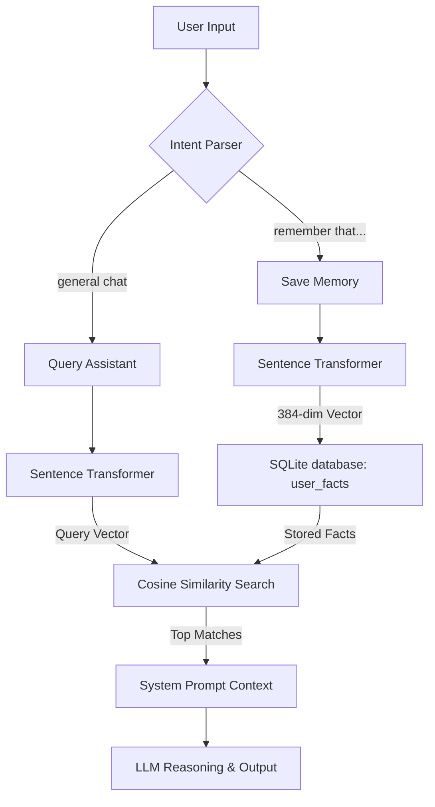

# Memory Manager Documentation: Long-Term Memory & RAG

The `MemoryManager` class is the central system responsible for managing long-term memory, conversation histories, system configurations, and automation triggers for the Kruuboo AI Assistant.

---

## 1. Architecture Overview
Kruuboo relies on a **local-first, semantic retrieval pipeline** (Retrieval-Augmented Generation / RAG) using a SQLite database (`memory.db`) and a lightweight vector embedding model (`all-MiniLM-L6-v2`) via `sentence-transformers`.



---

## 2. Database Schema
All database tables are initialized dynamically by `MemoryManager` in SQLite. The database schema contains the following tables:

### `user_facts`
Stores user-specific facts, configurations, and long-term personal context along with vector embeddings.
| Column | Type | Description |
|--------|------|-------------|
| `id` | `INTEGER` | Auto-incremented Primary Key. |
| `fact` | `TEXT` | The literal text of the remembered detail. |
| `category` | `TEXT` | Category of the fact (e.g. `personal`, `general`). |
| `embedding` | `BLOB` | 384-dimensional floating point vector (binary bytes). |
| `timestamp` | `DATETIME` | Timestamp of when the fact was saved. |

### `messages`
Stores conversation history (chat messages) for session persistence.
| Column | Type | Description |
|--------|------|-------------|
| `id` | `INTEGER` | Auto-incremented Primary Key. |
| `chat_id` | `TEXT` | Identifier grouping the chat session. |
| `role` | `TEXT` | Speaker type: `user` or `assistant`. |
| `content` | `TEXT` | Body content of the chat message. |
| `timestamp` | `DATETIME` | Timestamp of when the message was exchanged. |

### `automations`
Stores user-defined smart triggers and macros.
| Column | Type | Description |
|--------|------|-------------|
| `id` | `INTEGER` | Auto-incremented Primary Key. |
| `name` | `TEXT` | Visual name of the automation. |
| `trigger_type` | `TEXT` | Type of trigger (e.g. `voice`). |
| `trigger_config` | `TEXT` | JSON configuration containing triggers (e.g. trigger phrase). |
| `action_type` | `TEXT` | Target action (e.g. iot control, shell command). |
| `action_config` | `TEXT` | JSON configurations for actions. |
| `device` | `TEXT` | Targeted device compatibility (`desktop`, `mobile`, `both`). |
| `last_run` | `DATETIME` | Timestamp of last execution. |
| `enabled` | `INTEGER` | Boolean flag (0 = disabled, 1 = enabled). |

---

## 3. Core Python API Reference
The memory manager is defined in `python_backend/tools/memory_manager.py` and offers the following methods:

### Long-Term Memory / Facts
* `save_fact(fact: str, category: str = "general")`
  - Encodes the fact using `SentenceTransformer` to generate a float vector.
  - Converts the vector to raw bytes and inserts a new row in the `user_facts` table.
* `get_relevant_facts(query: str, limit: int = 5) -> list[str]`
  - Encodes the query into a vector.
  - Pulls all stored vectors from `user_facts`, calculates their cosine similarity (dot product) against the query vector, and returns the top `limit` textual facts.
* `get_all_facts(category: str = None) -> list[dict]`
  - Retrieves all facts ordered by time, optionally filtered by category. Returns list of dictionaries (with keys `id`, `fact`, `category`, `timestamp`).
* `delete_fact(fact_id: int)`
  - Deletes the targeted fact by ID from `user_facts`.

### Chat History
* `add_message(chat_id: str, role: str, content: str)`
  - Inserts a message row in `messages`.
* `get_history(chat_id: str, limit: int = 10) -> list[dict]`
  - Fetches the past conversation logs, returning standard message dictionaries sorted chronologically.
* `clear_history(chat_id: str)`
  - Deletes all messages matching the `chat_id`.

---

## 4. Frontend & Mobile Integration API
To expose this memory layer to local web components (Electron Settings UI) and future native sync clients (Android/iOS), the FastAPI backend hosts standard REST endpoints:

| Endpoint | Method | Security | Description |
|----------|--------|----------|-------------|
| `/memory/facts` | `GET` | Sync Token | Retrieve all stored facts for Electron UI. |
| `/memory/facts` | `POST` | Sync Token | Create a fact manually. |
| `/memory/facts/{id}` | `DELETE`| Sync Token | Remove a fact. |
| `/memories` | `GET` | Sync Token | Mobile-aligned alias to fetch user facts. |
| `/memories` | `POST` | Sync Token | Mobile-aligned alias to add a user fact. |
| `/memories/{id}` | `DELETE`| Sync Token | Mobile-aligned alias to delete a fact. |

---

## 5. Typical RAG Injection Example
During chat execution, facts matching the question are automatically queried and prepended to the system prompt context:

```python
# python_backend/agents/assistant.py
relevant_facts = memory.get_relevant_facts(query)
if relevant_facts:
    memory_context = "\nPERSONAL CONTEXT (Memories):\n- " + "\n- ".join(relevant_facts)
```

If the user queries: *"Who is my brother?"*, and the database has a saved fact *"remember that my brother is Bob"*, the resulting LLM system prompt reads:
```text
You are Kruuboo, a helpful desktop AI assistant.

PERSONAL CONTEXT (Memories):
- my brother is Bob

CONVERSATIONAL RULE: ...
```
This forces the LLM to reply contextually: *"Your brother is Bob."*
